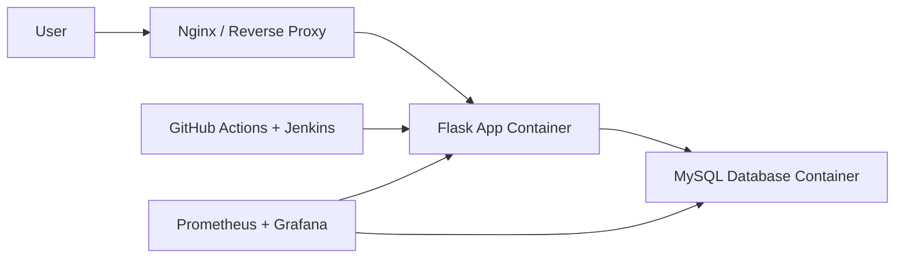

# Production-Ready Two-Tier DevSecOps Platform

[](https://github.com/Harshads-git/production-ready-two-tier-devsecops-platform/actions/workflows/python-tests.yml)
[](https://github.com/Harshads-git/production-ready-two-tier-devsecops-platform/actions/workflows/docker-build.yml)
[](https://github.com/Harshads-git/production-ready-two-tier-devsecops-platform/actions/workflows/vulnerability-scan.yml)
[](https://github.com/Harshads-git/production-ready-two-tier-devsecops-platform/actions/workflows/secret-scan.yml)

This is my independent portfolio project for learning AI-resilient cloud, DevOps, and systems design skills. It is a 15-day build that turns a small Flask and MySQL app into a documented DevSecOps platform with Docker, CI/CD, security scanning, Jenkins planning, Terraform starter infrastructure, and operations runbooks.

## Goal

Build a production-minded platform around a small web application:

- Flask application layer
- MySQL database layer
- Docker-based local runtime
- CI/CD pipeline
- AWS deployment
- Infrastructure as Code
- Security scanning and secret hygiene
- Monitoring, logging, backup, and failure recovery

## Why This Project Matters

The focus is not only writing application code. The focus is designing and operating the system around it:

- Architecture decisions
- Security tradeoffs
- Deployment automation
- Reliability practices
- Cost awareness
- Documentation and runbooks

## Current Status

15-day portfolio version complete:

- Project structure created
- Starter Flask service added with `/` and `/health` endpoints
- Basic pytest coverage added
- Local run and test scripts added
- Flask app containerized with Docker
- MySQL service added to Docker Compose
- Database configuration prepared through environment variables
- Table-backed visit API added
- GitHub Actions test, Docker build, secret scan, and vulnerability scan workflows added
- Jenkins pipeline planning and initial Jenkinsfile added
- AWS EC2 deployment architecture documented
- Terraform starter added
- Backup, restore, monitoring, operations, and final verification docs added
- Daily progress log complete through Day 15

For setup details, see [docs/setup-checklist.md](docs/setup-checklist.md).

## Local Run

From the project root:

```powershell
Set-ExecutionPolicy -Scope Process -ExecutionPolicy Bypass
.\scripts\run-local.ps1
```

Then open:

```text
http://127.0.0.1:5000
```

## Local Tests

From the project root:

```powershell
Set-ExecutionPolicy -Scope Process -ExecutionPolicy Bypass
.\scripts\test-local.ps1
```

## Docker Run

Start Docker Desktop first, then run:

```powershell
docker compose up -d --build
```

Stop the stack:

```powershell
docker compose down
```

The Compose stack starts:

- `app`: Flask application container
- `db`: MySQL database container on the internal Docker network

Health check:

```text
http://127.0.0.1:5000/health
```

Database connectivity check:

```text
http://127.0.0.1:5000/db/health
```

Visit API:

```powershell
Invoke-RestMethod -Method Post http://127.0.0.1:5000/visits
Invoke-RestMethod http://127.0.0.1:5000/visits
```

Full stack verification:

```powershell
Set-ExecutionPolicy -Scope Process -ExecutionPolicy Bypass
.\scripts\verify-stack.ps1
```

CI-style local verification:

```powershell
Set-ExecutionPolicy -Scope Process -ExecutionPolicy Bypass
.\scripts\verify-ci.ps1
```

Docker build verification:

```powershell
Set-ExecutionPolicy -Scope Process -ExecutionPolicy Bypass
.\scripts\verify-docker-build.ps1
```

Vulnerability verification:

```powershell
Set-ExecutionPolicy -Scope Process -ExecutionPolicy Bypass
.\scripts\verify-vulnerabilities.ps1
```

Final project verification:

```powershell
Set-ExecutionPolicy -Scope Process -ExecutionPolicy Bypass
.\scripts\final-verify.ps1
```

Secret hygiene verification:

```powershell
Set-ExecutionPolicy -Scope Process -ExecutionPolicy Bypass
.\scripts\verify-secrets.ps1
```

## Architecture



## Learning Log

Daily progress is tracked in [docs/daily-log.md](docs/daily-log.md).

## Delivery Plan

- 15-day roadmap: [docs/15-day-roadmap.md](docs/15-day-roadmap.md)
- Daily contribution strategy: [docs/contribution-strategy.md](docs/contribution-strategy.md)
- Daily automation workflow: [docs/daily-automation.md](docs/daily-automation.md)
- Week 1 review: [docs/week-1-review.md](docs/week-1-review.md)
- Week 2 review: [docs/week-2-review.md](docs/week-2-review.md)
- Pipeline gates: [docs/pipeline-gates.md](docs/pipeline-gates.md)
- AWS deployment plan: [docs/aws-deployment-plan.md](docs/aws-deployment-plan.md)
- Operations guide: [docs/operations.md](docs/operations.md)
- Monitoring plan: [docs/monitoring-plan.md](docs/monitoring-plan.md)
- Final summary: [docs/final-project-summary.md](docs/final-project-summary.md)
