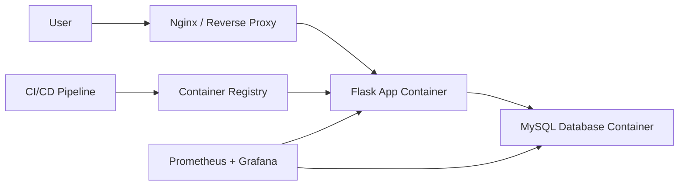

# Production-Ready Two-Tier DevSecOps Platform

This is my independent portfolio project for learning AI-resilient cloud, DevOps, and systems design skills. The project starts as a simple two-tier Flask and MySQL application, then grows into a secure, automated, observable, and resilient cloud deployment.

## Goal

Build a production-minded platform around a small web application:

- Flask application layer
- MySQL database layer
- Docker-based local runtime
- CI/CD pipeline
- AWS deployment
- Infrastructure as Code
- Security scanning and secret hygiene
- Monitoring, logging, backup, and failure recovery

## Why This Project Matters

The focus is not only writing application code. The focus is designing and operating the system around it:

- Architecture decisions
- Security tradeoffs
- Deployment automation
- Reliability practices
- Cost awareness
- Documentation and runbooks

## Current Status

Day 2 is complete locally:

- Project structure created
- Starter Flask service added with `/` and `/health` endpoints
- Basic pytest coverage added
- Local run and test scripts added
- Documentation started
- Daily progress log created

Before the app can be run locally, complete the Python setup checklist in [docs/setup-checklist.md](docs/setup-checklist.md).

## Local Run

From the project root:

```powershell
Set-ExecutionPolicy -Scope Process -ExecutionPolicy Bypass
.\scripts\run-local.ps1
```

Then open:

```text
http://127.0.0.1:5000
```

## Local Tests

From the project root:

```powershell
Set-ExecutionPolicy -Scope Process -ExecutionPolicy Bypass
.\scripts\test-local.ps1
```

## Planned Architecture



## Learning Log

Daily progress is tracked in [docs/daily-log.md](docs/daily-log.md).
