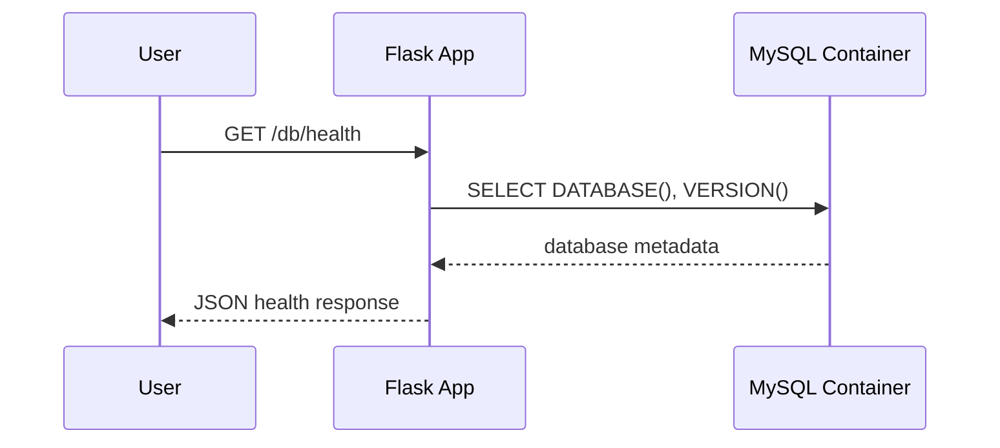

# Architecture Notes

## System Intent

This project will become a secure and automated two-tier application platform. The first tier is a Flask web service. The second tier is a MySQL database.

## Initial Components

- User-facing HTTP endpoint
- Flask application service
- MySQL database
- Reverse proxy in front of the application
- CI/CD pipeline for build and deployment
- Monitoring stack for service health and metrics

## Current Runtime Flow

## Early Design Decisions

- Keep application code small so the main learning focus stays on infrastructure.
- Add a `/health` endpoint early because deployment tools and monitors need a reliable health check.
- Use environment variables for configuration, but never commit real secrets.
- Document architecture decisions as the project grows.
- Keep app health and database health as separate endpoints so failures are easier to diagnose.

## Future Decisions To Make

- Whether the first cloud database should be containerized MySQL on EC2 or managed RDS.
- Whether Jenkins, GitHub Actions, or both should be used in the final portfolio version.
- How to restrict access to admin tools such as Jenkins.
- How to back up and restore database state.
