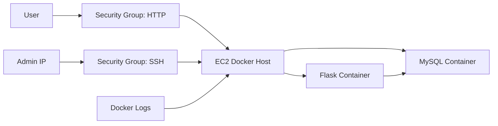

# AWS Deployment Plan

This project is designed for an EC2-first deployment path. The plan is intentionally conservative and cost-aware.

## Target Architecture

## Scope

The first cloud version deploys the existing Docker Compose stack on one EC2 instance.

This keeps the project focused on:

- Secure access boundaries.
- Repeatable provisioning.
- Docker-based deployment.
- Operational runbooks.
- Cost control.

## Intentional Tradeoffs

| Decision | Reason | Future Upgrade |
| --- | --- | --- |
| EC2 with Docker Compose | Simple, inspectable, low-cost first deployment | ECS, EKS, or Kubernetes |
| MySQL container on EC2 | Good for learning two-tier operations | Amazon RDS |
| SSH restricted by CIDR | Reduces admin exposure | SSM Session Manager |
| No public database port | Database should stay private to the host/network | Private subnet or RDS security group |
| No registry publish yet | Scanning and tagging should mature first | ECR with immutable tags |

## Security Boundaries

- SSH should be restricted to a known admin CIDR.
- HTTP should be restricted during testing, then opened deliberately if public demo access is needed.
- MySQL should not be exposed publicly.
- Real secrets should come from environment files, GitHub Actions secrets, Jenkins credentials, or a cloud secret manager.

## Deployment Sequence

1. Provision EC2 and security group with Terraform.
2. Install Docker and Docker Compose on the host.
3. Copy or clone the repository onto the host.
4. Create a real `.env` file on the host, not in Git.
5. Run `docker compose up -d --build`.
6. Verify `/health`, `/db/health`, `POST /visits`, and `GET /visits`.
7. Record deployment evidence in the runbook.

