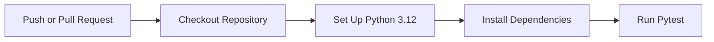
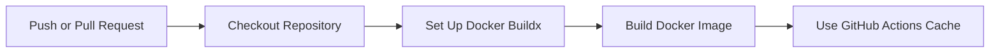
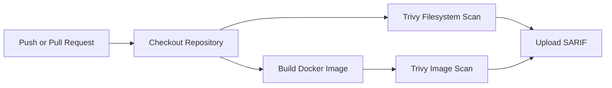
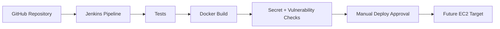

# CI/CD Notes

## Day 8 Baseline

The first CI workflow is `.github/workflows/python-tests.yml`.

It runs on:

- Pushes to `main`.
- Pull requests targeting `main`.

## Pipeline Steps



## Why This Matters

This workflow turns tests into a shared quality gate. The project is no longer only tested manually on one laptop; GitHub now validates the Python test suite whenever code changes reach `main` or a pull request.

## Current Scope

The workflow checks application unit tests only.

It does not yet:

- Build the Docker image.
- Start the MySQL Compose stack.
- Scan dependencies or containers.
- Deploy to cloud infrastructure.

Those checks will be added in later project days.

## Day 9 Docker Build Gate

The second CI workflow is `.github/workflows/docker-build.yml`.

It runs on:

- Pushes to `main`.
- Pull requests targeting `main`.

## Docker Build Steps



## Why This Matters

Python tests prove the code behaves as expected. Docker build CI proves the app can be packaged in a clean environment. Both gates are needed before deployment automation is trustworthy.

The workflow intentionally does not push to a registry yet. Publishing images should come after scanning, tagging strategy, and registry decisions are documented.

## Local Equivalent

Run:

```powershell
Set-ExecutionPolicy -Scope Process -ExecutionPolicy Bypass
.\scripts\verify-ci.ps1
```

For Docker build verification:

```powershell
Set-ExecutionPolicy -Scope Process -ExecutionPolicy Bypass
.\scripts\verify-docker-build.ps1
```

## Day 10 Secret Scan Gate

The third CI workflow is `.github/workflows/secret-scan.yml`.

It runs Gitleaks on pushes and pull requests targeting `main`. This helps catch accidentally committed API keys, private keys, tokens, and other secret-like values before they become operational risk.

## Day 11 Vulnerability Scan Gate

The fourth CI workflow is `.github/workflows/vulnerability-scan.yml`.

It runs on:

- Pushes to `main`.
- Pull requests targeting `main`.

## Vulnerability Scan Steps



## Why This Matters

Secret scanning catches credentials. Vulnerability scanning catches known weaknesses in dependencies and container layers. Both are needed before a platform can be treated as deployment-ready.

The workflow currently focuses on high and critical findings. Medium and low findings can be reviewed later as the security process matures.

## Local Vulnerability Scan

If Trivy is installed locally:

```powershell
Set-ExecutionPolicy -Scope Process -ExecutionPolicy Bypass
.\scripts\verify-vulnerabilities.ps1
```

## Day 12 Jenkins Planning

Jenkins is planned as a self-hosted CI/CD path that complements GitHub Actions.

GitHub Actions currently handles repository-native gates:

- Python tests.
- Docker image build.
- Secret scanning.
- Vulnerability scanning.

Jenkins will focus on:

- Self-hosted automation.
- Build agent toolchain management.
- Jenkins Credentials Manager.
- Manual deployment approvals.
- Future EC2 deployment stages.

Jenkins planning docs:

- `jenkins/pipeline-design.md`
- `jenkins/credentials-plan.md`
- `jenkins/agent-requirements.md`

## Jenkins Flow



## Day 13 Jenkinsfile

The first `Jenkinsfile` implements these non-deployment stages:

- Checkout
- Preflight
- Python Tests
- Docker Build
- Secret Scan
- Vulnerability Scan

The Jenkinsfile currently assumes a Windows Jenkins agent because the local verification scripts are PowerShell based.

Deployment is intentionally deferred until the EC2 target, credentials, and rollback process are documented.

## Day 14 Week 2 Review

Week 2 established the project's first CI/CD and security gate set:

- Python Tests
- Docker Build
- Secret Scan
- Vulnerability Scan
- Jenkins non-deployment pipeline

The current gate inventory is documented in `docs/pipeline-gates.md`.

The Week 2 summary is documented in `docs/week-2-review.md`.
