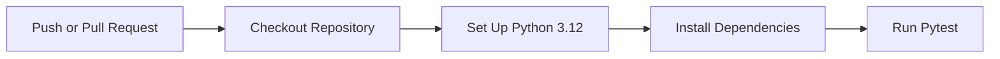

# CI/CD Notes

## Day 8 Baseline

The first CI workflow is `.github/workflows/python-tests.yml`.

It runs on:

- Pushes to `main`.
- Pull requests targeting `main`.

## Pipeline Steps



## Why This Matters

This workflow turns tests into a shared quality gate. The project is no longer only tested manually on one laptop; GitHub now validates the Python test suite whenever code changes reach `main` or a pull request.

## Current Scope

The workflow checks application unit tests only.

It does not yet:

- Build the Docker image.
- Start the MySQL Compose stack.
- Scan dependencies or containers.
- Deploy to cloud infrastructure.

Those checks will be added in later project days.

## Local Equivalent

Run:

```powershell
Set-ExecutionPolicy -Scope Process -ExecutionPolicy Bypass
.\scripts\verify-ci.ps1
```

