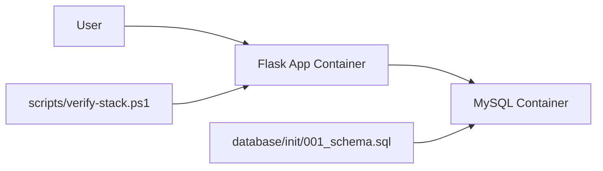

# Week 1 Review

Week 1 turned a small Flask app into a local two-tier platform with repeatable tests, Docker runtime, MySQL, and basic reliability checks.

## Completed Outcomes

- Created an independent portfolio repository.
- Added a Flask application with `/health`.
- Added pytest coverage.
- Containerized the app with Docker.
- Added MySQL through Docker Compose.
- Added database config through environment variables.
- Added `/db/health` to prove Flask can reach MySQL.
- Added a table-backed visit API with `POST /visits` and `GET /visits`.
- Added schema initialization through `database/init/001_schema.sql`.
- Added full-stack verification and diagnostics scripts.

## Current Architecture

## Reliability Decisions

- Flask has a lightweight `/health` endpoint for app-level health.
- `/db/health` is separate so database failures are visible without confusing them with app process failures.
- MySQL is internal to the Docker network and is not published to the host.
- MySQL data is stored in a named volume.
- Local schema initialization is versioned under `database/init`.
- `scripts/verify-stack.ps1` checks the full runtime path after changes.
- `scripts/diagnose-stack.ps1` gathers logs and runtime state for troubleshooting.

## Security Notes

- Real secrets are not committed.
- `.env.example` contains placeholders only.
- The app container runs as a non-root user.
- The database is not exposed through a host port.

## Known Gaps

- CI/CD is not added yet.
- Container image scanning is not added yet.
- Cloud deployment is not added yet.
- The app has no authentication because this stage focuses on infrastructure workflow.

## Week 2 Focus

Week 2 should add CI/CD and security basics:

- GitHub Actions test workflow.
- Docker image build workflow.
- Secret scanning.
- Dependency/container scanning.
- Jenkins pipeline planning.

