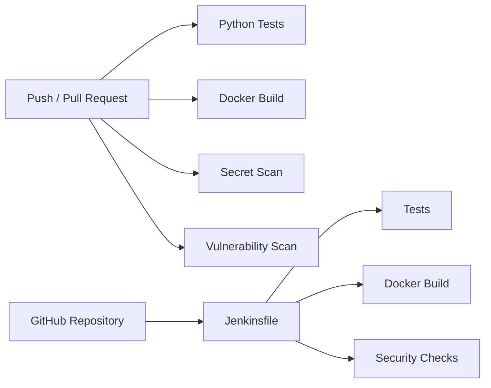

# Week 2 Review

Week 2 added CI/CD and security gates around the two-tier platform.

## Completed Outcomes

- Added GitHub Actions Python test workflow.
- Added GitHub Actions Docker build workflow.
- Added Gitleaks secret scanning.
- Added Trivy vulnerability scanning.
- Added local verification scripts for tests, Docker build, secrets, vulnerabilities, and Jenkinsfile structure.
- Planned Jenkins as a self-hosted automation path.
- Added the first Jenkinsfile with non-deployment stages.

## CI/CD Architecture

## Security Improvements

- Real `.env` files are ignored.
- `.env.example` uses placeholders only.
- Gitleaks scans commits for secrets.
- Trivy scans dependencies and image layers.
- Jenkins credential IDs are documented without storing secret values.
- Deployment remains blocked until least-privilege cloud access is designed.

## Important Design Decisions

- GitHub Actions remains the fast repository-native quality gate.
- Jenkins complements GitHub Actions instead of replacing it.
- Docker images are built but not published yet.
- Deployment is postponed until AWS architecture, credentials, rollback, and access controls are documented.

## Known Gaps

- No cloud infrastructure yet.
- No container registry publishing yet.
- No Jenkins runtime execution yet.
- No infrastructure scanning yet.
- No monitoring stack yet.

## Week 3 Focus

Week 3 should begin cloud and infrastructure planning:

- AWS target architecture.
- EC2-first deployment scope.
- Security group model.
- Terraform foundation.
- Cost and access assumptions.

